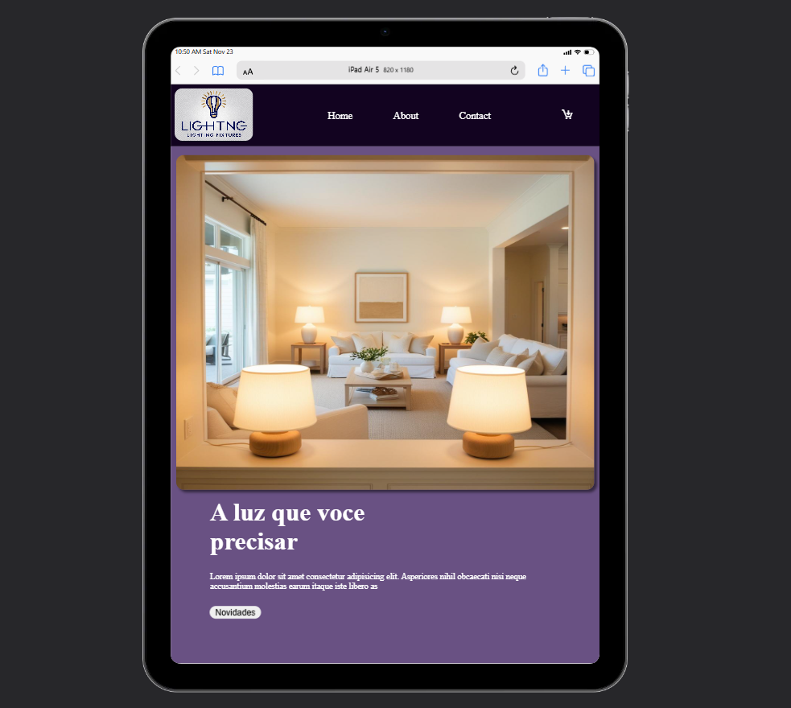

# Landing Page - Lighting

Bem-vindo ao repositório da Landing Page - Lighting!
Este projeto é uma landing page responsiva desenvolvida com HTML, CSS e JavaScript. A página foi criada para demonstrar uma interface moderna e funcional para uma loja de luminárias.

## 🎯 Sobre o Projeto
A landing page foi projetada para oferecer: <br>
- Um design visualmente atraente, utilizando uma paleta de cores agradáveis.
- Conteúdo organizado, com informações claras e destaque para produtos.
- Responsividade, garantindo uma experiência otimizada em dispositivos móveis, tablets e desktops.

## 🚀 Funcionalidades
- Destaque de Produtos: Produtos com imagem, descrição e preço.
- Responsividade: Layout adaptado para diferentes tamanhos de tela.
- Botão "Novidades": Ao clicar no botão Novidades, os produtos são exibidos na seção inferior, que inicialmente está vazia, criando uma experiência dinâmica para o usuário.

## Tecnologias Utilizadas
- HTML
- CSS
- JavaScript

## Preview




## 🔧 Como Executar o Projeto

1. Clone este repositório:
```bash
git clone https://github.com/dorffdaniel/landing-Page-Brilho-Ideal-
```
2. Abra o arquivo `index.html` no navegador.